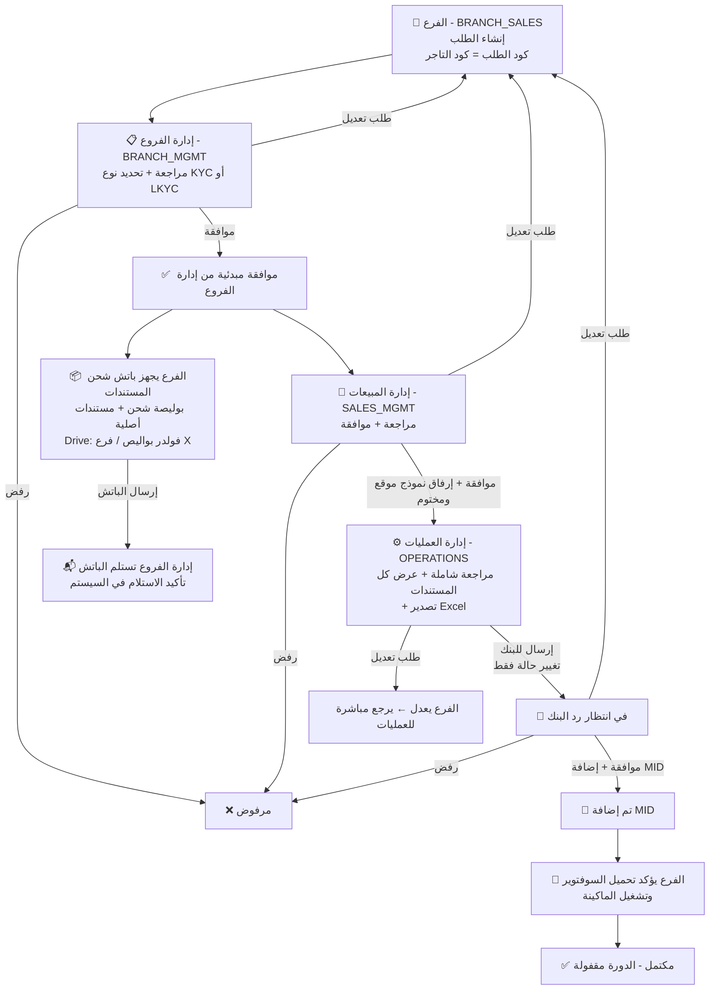

# دورة عمل نظام تهيئة التجار (الإصدار الثاني V2)

> تاريخ التحديث: 29 أبريل 2026

## المراحل الأساسية لدورة العمل

تتكون دورة العمل الجديدة من 7 مراحل تمر بها طلبات تهيئة التجار:

### 1. تقديم الطلب من الفرع (Branch Submission)
* **المسؤول:** مسئول المبيعات بالفرع (`BRANCH_SALES`).
* **الإجراء:** إدخال بيانات التاجر ورفع المستندات.
* **رقم الطلب (Request ID):** 
  * للتاجر العادي: يكون نفس **كود العميل** (Customer Code) ويجب أن يكون فريداً (Unique).
  * للتاجر الخارجي: يتم إنشاء كود تلقائي من النظام.
* **الحالة الأولية:** `Pending` وتنتقل للمرحلة التالية.

### 2. مراجعة إدارة الفروع (Branch Management Review)
* **المسؤول:** إدارة الفروع المركزية (`BRANCH_MGMT`).
* **الإجراءات المتاحة:**
  * **موافقة مبدئية:** مع تحديد نوع التوثيق `KYC` أو `LKYC`. (ينتقل الطلب لمرحلة المبيعات).
  * **طلب تعديل:** إرجاع الطلب للفرع للتعديل.
  * **رفض:** إغلاق الطلب نهائياً كـ `Rejected`.

### 3. شحن المستندات (Document Shipment)
* **المسؤول:** مسئول المبيعات بالفرع (`BRANCH_SALES`).
* **الإجراء:** تجهيز حزمة (Batch) بالطلبات التي حصلت على موافقة مبدئية، وإرسالها مع بوليصة شحن.
* يتم رفع صورة بوليصة الشحن على Google Drive في مجلد `بواليص الشحن / اسم الفرع`.
* **تأكيد الاستلام:** تقوم إدارة الفروع بتأكيد استلام الباتش في النظام.

### 4. مراجعة إدارة المبيعات (Sales Management Review)
* **المسؤول:** إدارة المبيعات (`SALES_MGMT`).
* **الإجراءات المتاحة:**
  * **موافقة:** يجب إرفاق **نموذج موقع ومختوم** من الإدارة. (ينتقل الطلب للعمليات).
  * **طلب تعديل:** إرجاع الطلب للفرع للتعديل.
  * **رفض:** إغلاق الطلب نهائياً.

### 5. مراجعة العمليات (Operations Review)
* **المسؤول:** إدارة العمليات (`OPERATIONS`).
* **الإجراءات المتاحة:**
  * **مراجعة شاملة:** عرض كافة المستندات والنموذج الموقع من المبيعات.
  * **إرسال للبنك:** تغيير حالة الطلب ليدل على أنه في انتظار رد البنك.
  * **طلب تعديل:** إرجاع الطلب للفرع للتعديل. (بمجرد تعديل الفرع، يعود الطلب **مباشرة للعمليات** متخطياً إدارة الفروع والمبيعات).
  * **تصدير للـ Excel:** إمكانية تنزيل بيانات الطلب.

### 6. مراجعة البنك (Bank Review)
* **المسؤول:** إدارة العمليات (`OPERATIONS`) (تقوم بتسجيل رد البنك في النظام).
* **الإجراءات المتاحة:**
  * **موافقة البنك:** يتم إدخال كود التاجر (`MID`) الخاص بالبنك. (ينتقل لمرحلة التأكيد).
  * **رفض البنك:** إغلاق الطلب نهائياً.
  * **تعديل من البنك:** إرجاع الطلب للفرع.

### 7. تأكيد تشغيل السوفتوير (Software Activation)
* **المسؤول:** مسئول المبيعات بالفرع (`BRANCH_SALES`).
* **الإجراء:** بعد استلام الماكينة والـ MID، يقوم الفرع بتأكيد تحميل السوفتوير وتشغيل الماكينة لدى التاجر.
* **الحالة النهائية:** `Completed` والدورة تصبح مغلقة.

---

## المخطط الانسيابي للدورة (Flowchart)

